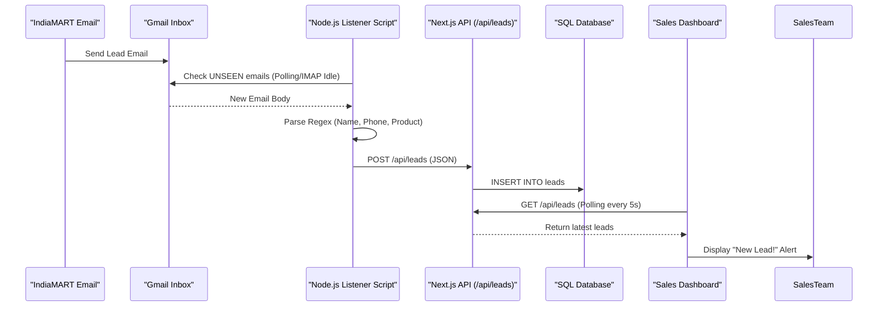

# Real-Time IndiaMART Lead Capture Architecture

## 1. System Overview

The Lead Capture Engine is designed to automatically ingest leads from IndiaMART emails, parse them into structured data, and display them on a real-time dashboard for immediate sales action.

### Core Components

1.  **Email Listener Service**: A standalone Node.js process that monitors the sales inbox (Gmail).
2.  **Parser Engine**: A regex-based extraction logic module to structure raw email content.
3.  **Central API**: A Next.js API route (`/api/leads`) that validates and ingests data.
4.  **Database**: A structured storage (currently SQLite, scalable to PostgreSQL) for lead records.
5.  **Real-Time Dashboard**: A React-based interface that auto-refreshes to show new leads instantly.

## 2. Technical Stack

*   **Frontend**: Next.js 14 (App Router), React, Tailwind CSS.
*   **Backend API**: Next.js API Routes (Serverless functions).
*   **Lead Worker**: Node.js script using `imap-simple` for email monitoring.
*   **Database**: SQLite (via Prisma ORM) for local dev simplicity; PostgreSQL for production.
*   **Communication**: REST API for ingestion; Polling (SWR-style) for dashboard updates.

## 3. Data Flow Diagram

## 4. Scalability & Future Roadmap

This prototype uses **Polling** for simplicity. For high-scale production usage:

1.  **Switch to Push Notifications**:
    *   Instead of polling Gmail every 30s, use **Gmail API Push Notifications (Webhooks)**.
    *   Setup Google Cloud Pub/Sub to trigger a webhook (`/api/webhooks/gmail`) immediately upon email arrival.
    *   This reduces latency to <2 seconds.

2.  **Database Migration**:
    *   Switch `prisma` provider from `sqlite` to `postgresql`.
    *   Use a managed DB like Supabase, Neon, or AWS RDS.
    *   This allows multiple concurrent connections and better reliability.

3.  **Deployment**:
    *   **Frontend/API**: Deploy to Vercel.
    *   **Listener Worker**: Deploy to a long-running instance (e.g., Render Background Worker, Railway, DigitalOcean Droplet, or AWS EC2). The listener cannot run on Vercel Serverless as it needs to maintain an open IMAP connection.

4.  **Multi-Channel Support**:
    *   The API (`POST /api/leads`) is generic. You can easily add listeners for:
        *   **WhatsApp**: Via Twilio/Meta API webhook.
        *   **Website Forms**: Direct POST from your contact form.
        *   **Facebook Leads**: Via Zapier webhook.

## 5. Security Best Practices

*   **Credentials**: Use Environment Variables for all sensitive keys. NEVER commit `.env`.
*   **OAuth2**: For production Gmail access, switch from App Passwords to OAuth2 authentication to avoid password rotation issues.
*   **API Security**: Add an API Key header (`x-api-key`) to the ingestion endpoint to prevent unauthorized data injection.
